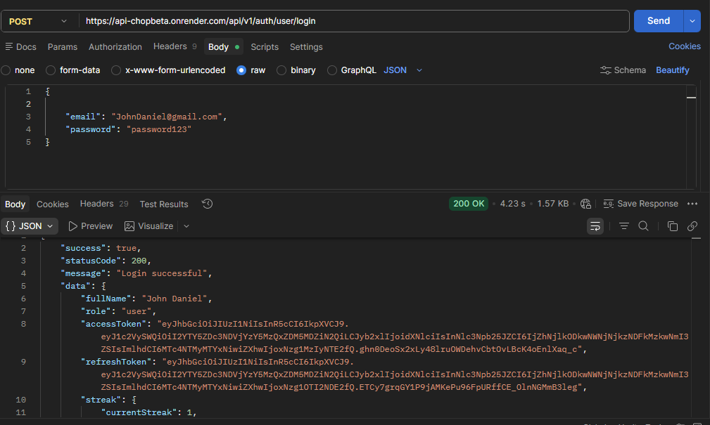
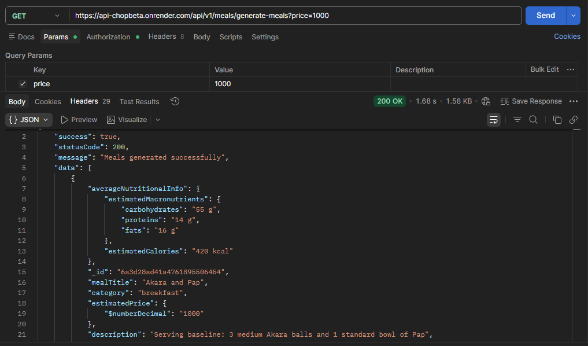

#  ChopBeta — Smart Food Recommendation API

ChopBeta is a food-tech backend system that intelligently generates meal options based on a user's budget, time of day, and nutritional considerations.

This project demonstrates advanced backend architecture, secure authentication systems, and real-world problem-solving without exposing proprietary business logic.

---

##  Core Features

-  Budget-Based Meal Generation  
-  Time-Aware Meal Suggestions  
  - Breakfast  
  - Lunch  
  - Dinner  
  - Snacks  
  - Midnight Meals  

-  Explore System  
  - Users can browse and select meals manually  

---

##  Authentication & Security

- JWT-based authentication  
- Google OAuth login  
- Password hashing (bcrypt)  
- Device/session tracking  
- Limited concurrent device login  
- Role-Based Access Control (RBAC)  

---

##  System Intelligence

- Personalized meal suggestions based on:
  - Budget constraints  
  - Time of day  
- Weekly logic checks (custom middleware)  
- User status handling system  

---

##  Architecture Overview

The system follows a modular and scalable architecture:

- Controller Layer → Handles HTTP requests  
- Service Layer → Handles business logic  
- Model Layer → Database schema  

Additional Layers:
- Validation Layer (Zod)
- Middleware Layer:
  - Authentication
  - Error handling
  - User state management
  - Weekly logic checks

---

##  API Preview

| Method | Endpoint              | Description                     |
|--------|----------------------|---------------------------------|
| POST   | /api/v1/auth/user/signup      | Register a new user             |
| POST   | /api/v1/auth/user/login         | Authenticate user               |
| GET    | /api/v1/meals/generate-meals?     | Generate meals (budget-based)   |
| GET    | /api/v1/meals/quick-meals?   | Browse available meals          |
| GET    | /api/v1/auth/user/sessions       | View active sessions/devices    |

---

##  Sample Response

```json
{
  "success": true,
    "statusCode": 200,
    "message": "Meals generated successfully",
    "data": [
        {
            "averageNutritionalInfo": {
                "estimatedMacronutrients": {
                    "carbohydrates": "55 g",
                    "proteins": "14 g",
                    "fats": "16 g"
                },
                "estimatedCalories": "420 kcal"
            },
            "_id": "6a3d28ad41a4761895506454",
            "mealTitle": "Akara and Pap",
            "category": "breakfast",
            "estimatedPrice": {
                "$numberDecimal": "1000"
            },
            "description": "Serving baseline: 3 medium Akara balls and 1 standard bowl of Pap",
            "type": "others",
            "createdAt": "2026-06-25T13:10:05.842Z",
            "updatedAt": "2026-07-16T13:17:34.454Z",
            "imageUrl": "https://res.cloudinary.com/ddar8cv1l/image/upload/v1784207853/ykcfnq2qbv8zabpn3wcq.jpg"
        }
    ]
}
```

## Preview




## Live API

https://api-chopbeta.onrender.com

## Note on Source Code

The full codebase is kept private to protect proprietary business logic and core algorithms.

This repository serves as a technical showcase of the system’s design, architecture, and capabilities.

## Purpose

ChopBeta was built to demonstrate:

- Real-world backend system design
- Secure authentication & session management
- Scalable architecture patterns
- Intelligent API design

## Authors

**ChopBeta** is proudly built by the **ASAP Team**.

- **Treasure Epebifie** — Backend Developer and Lead Engineer, ASAP Team
https://github.com/treepebifie-arch